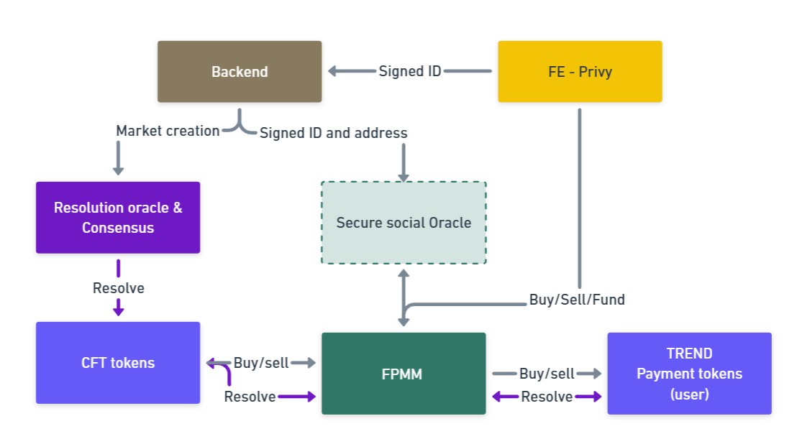

# Social Oracle Tehnical

## General

**Social Oracle** is a decentralized prediction marketplace focused on social events and platform-based outcomes. The platform enables users to trade on the outcomes of real-world events, leveraging the **Fixed Product Market Maker (FPMM)** model and conditional tokens for robust and transparent trading mechanisms.  

Social Oracle is powered by **Privy Embedded Wallets** for seamless integration with social networks and **Gnosis CFT tokens** for conditional tokens. We also use a custom-created **Secure Social Oracle**, which provides a secure way to link GitHub IDs to wallet addresses and utilize this in smart contracts. Another key component is **Resolution Oracle** where users can vote on the outcome of the events.

The initial implementation focuses on social platforms like LinkedIn, X, Twitch, and others. The product is designed to highlight social platform activity while integrating GitHub login for seamless onboarding.

The complete application is built on three main components:

- **Frontend (FE)**: Developed using Vue.js and integrated with Privy Smart Wallets for seamless user experiences.  
- **Backend (BE)**: Built with Node.js and utilizes a MySQL database for efficient data management and storage.  
- **Smart Contracts (SC)**: EVM-based smart contracts ensure secure and decentralized execution of on-chain logic.  

## Smart contracts and orales

**Arhitecure scheme**

## Secure Social Oracle

To enable the application to work in a secure manner, we use a signature-based mechanism to securely establish the linkage between social IDs and wallet addresses. This linkage is then stored in a secure database on the backend.

Our oracle utilizes a specific address (referred to as the signer), whose private key is securely stored in the backend system. This signer address is the sole entity authorized to send data to the smart contract. When we transmit signed message data, the signer information can be verified on-chain within the smart contract. This ensures that the data originates exclusively from our backend and has not been tampered with.

These two mechanisms provide a secure and reliable way to bridge social IDs (powered by Privy) with on-chain smart contracts. This approach ensures that the communication between off-chain social identity systems and blockchain components is both trusted and tamper-proof.

## Resolition Oracle
The Resolution Oracle operates on a voting principle.

Whitelisted users have the ability to vote on outcome resolutions. Each user's vote contributes to determining the resolution of a specific market. The consensus mechanism for each market is predefined, ensuring transparency in how results are finalized.

In the future, this mechanism is planned to be upgraded, introducing a weighted voting system. This upgrade will allow more active and engaged social users to have greater influence over the voting outcomes, reflecting their higher level of participation and activity within the system.

## The conditional tokens and FPMM
Prediction market logic works on the principle of Gnosis **conditional tokens** and the **FPMM** (Fixed Product Market Maker).

Conditional tokens represent outcome shares, with each outcome share being an ERC-1155 token that can be traded. These tokens enable decentralized and transparent resolution of prediction markets by allowing users to speculate on various outcomes.

For more details about conditional tokens, visit the official documentation:  
[Conditional Tokens Documentation](https://conditional-tokens.readthedocs.io/en/latest/)

### Prediction Set Outcomes  

Each prediction market consists of multiple outcomes, and the share prices adjust dynamically based on market demand using the FPMM model.  

Outcome shares are evenly distributed at market creation unless prior probabilities are defined:  
- **2 Outcomes:** 50% each.  
- **3 Outcomes:** 33.33% each.  
- **4 Outcomes:** 25% each.  

Prices adjust based on demand. Higher demand increases an outcome's share price while lowering competing outcomes, maintaining a total sum of 100%.  

## FPMM: Fixed Product Market Maker  

The **Fixed Product Market Maker (FPMM)**, based on Gnosis FPMM, facilitates trading of outcome shares using conditional tokens. It operates similarly to automated market makers like Uniswap but is specifically tailored for prediction markets.  

#### FPMM Invariant Formula  

The FPMM maintains an invariant constant:  
**constant = product("Total Number Of Tokens" for each OutcomeShare)**  

### Example with FPMM  
For a market like "Will GitHub repository kubernetes/kubernetes hit 150k stars by the end of 2025?" with 10TRADE initial liquidity.
The 10TRADE is converted into 10 **Y** tokens and 10 **N** tokens.

Now let’s say Joe buys 10TRADE worth of **Y** tokens from KUB:

1. Joe Sends 10TRADE to KUB pool.
2. KUB converts the 10TRADE into 10 **Y** and 10 **N** outcome tokens. KUB pool now has 20 **Y**and 20 **N** tokens, breaking its invariant (expected constant: 100, current constant: 400).
3. KUB returns 15 **Y** tokens to Joe, restoring the constant.

**Post-Trade State**
At the end of this trade:  
- KUB pool has **5 Y** tokens and **20 N** tokens remaining in its inventory.  
- KUB pool estimates the odds as:  
  - **Y:** 80%  
  - **N:** 20%

